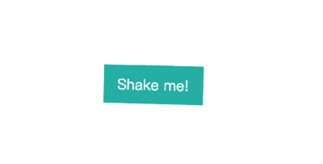

# rshake

> 给页面元素添加晃动效果的组件

[](https://www.npmjs.com/package/rshake) [](https://standardjs.com)

## [Demo]()


## Install

```bash
npm install rshake -S
```

## Usage

```jsx
import React, { Component } from 'react'

import Rshake from 'rshake'

class Example extends Component {
  render () {
    return (
      <div>
        <Rshake type='little' rate='200' >
            <i>xixi</i>
        </Rshake>
      </div>
    )
  }
}
```

## Props

| Prop      | Detail                                         | Default              |
| --------- | ---------------------------------------------- | -------------------- |
| type  | 晃动的类型 |  `slow | little | hard | horizontal | vertical | rotate | opacity | chunk`  |
| rate  | 晃动的频率 |  `100 | 200 | 500 | ...`  |
| hover | 设置为悬浮触发 | `false` |

## Update

### 0.1.1 2019.10.21
* 更新文档
* 仓库迁移

### 0.1.1 2019.05.22
* 初版发布

## License

MIT © [browniu](https://github.com/browniu)

